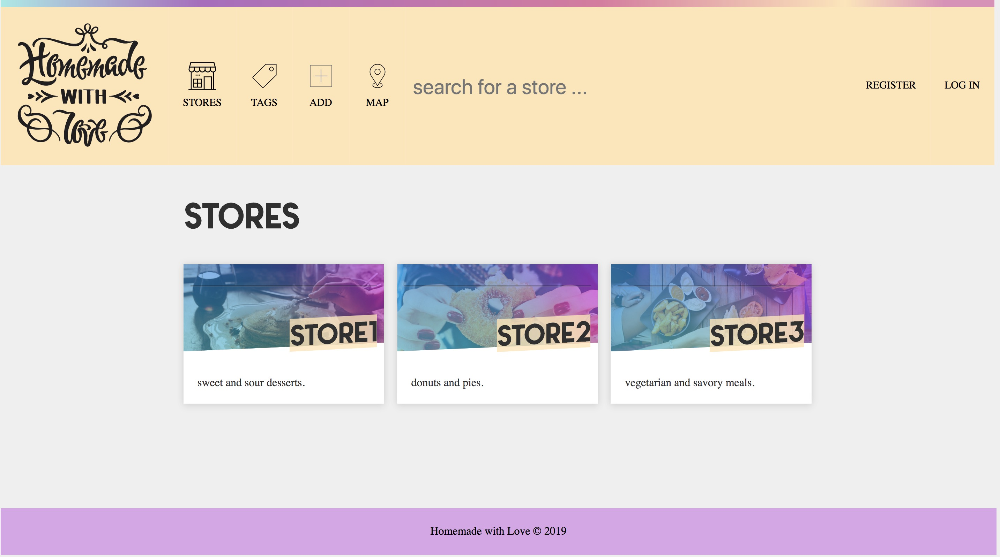
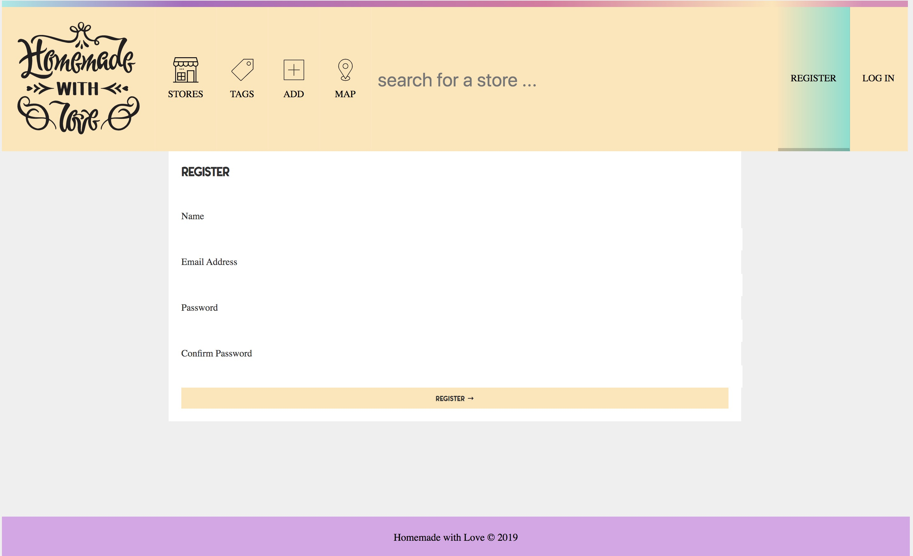
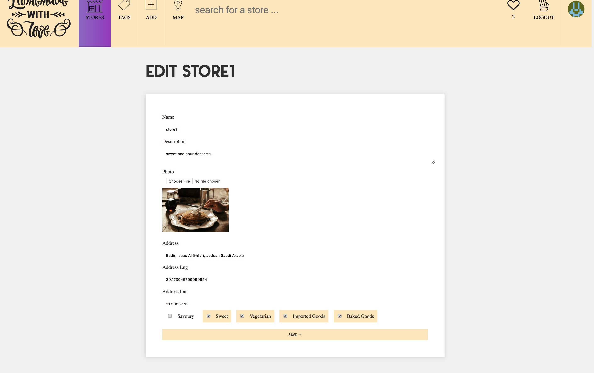
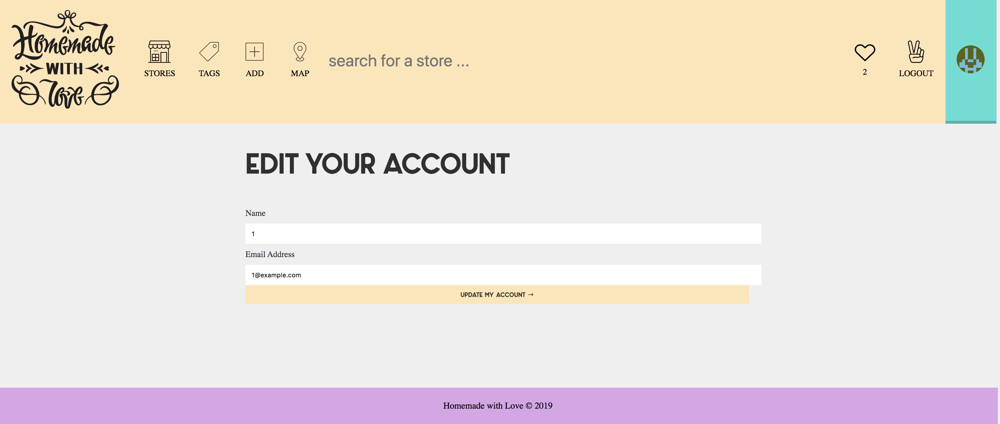

## Project Title
- Homemade with Love

## Description
- Homemade with Love is a web app made for productive families stores found in KSA. It allows stores to add their store and provide a location for the store on the map, while is possible to edit the store information at anytime . 

## Technical Used
- Nodejs/Express 
- MongoDB
- Pug
- Sass
- Webpack

## Wireframes
- Homepage: 

- Registeration page:

- Edit store page:

- Edit account page:

## User Stories
- As a user I would like to add and edit my store .
- As a user I would like to register and login while also being able to edit my account .
- As a user I would like to heart stores as favorites . 
- As a user I would like to search for stores using their location and title . 

## Problem-Solving Strategy
- logging items to the console .
- search for possible solutions for errors .
- reading needed parts of documentations . 
